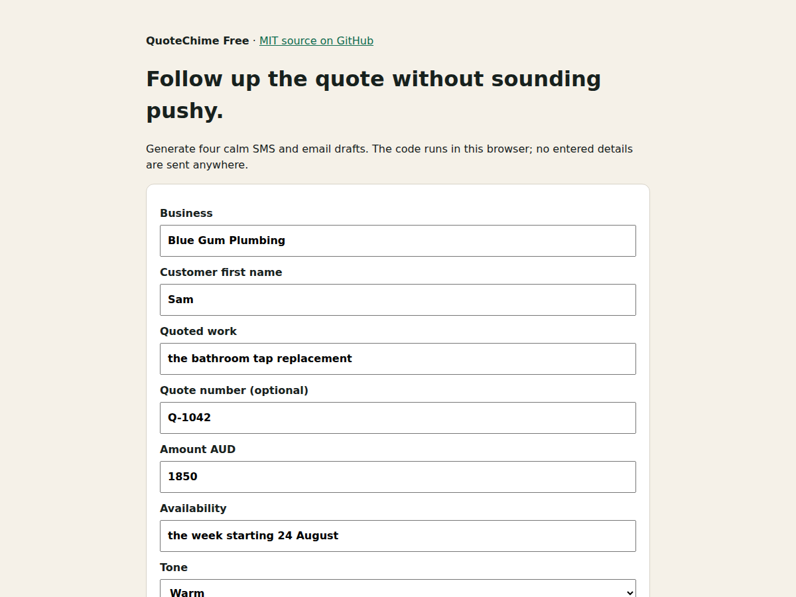

# QuoteChime Free

A tiny, dependency-free quote follow-up sequence generator. It creates four
calm SMS/email drafts for service businesses without uploading customer or
quote data.



**[Use the live generator](https://quotechime.pages.dev/#generator)** ·
**[Compare the A$3, A$7 and A$19 one-time packs](https://quotechime.pages.dev/#offers)**

Free companion tools:

- [business-day follow-up planner + calendar reminders](https://quotechime.pages.dev/tools/follow-up-date-calculator)
- [quote expiry date calculator](https://quotechime.pages.dev/tools/quote-expiry-date-calculator)
- [lost quote revenue scenario calculator](https://quotechime.pages.dev/tools/lost-quote-revenue-calculator)
- [quote objection response generator](https://quotechime.pages.dev/tools/quote-objection-response-generator)
- [embeddable privacy-first website widget](https://quotechime.pages.dev/tools/embed-quote-follow-up-widget)

## Why this exists

An unanswered quote does not always mean “no”. It can mean the customer missed
the email, has a question, is comparing scope, or is not ready. One generic
“just following up” message does not help distinguish those situations.

QuoteChime builds a finite four-touch rhythm:

1. confirm the quote arrived;
2. make questions easy;
3. ask for a clear decision;
4. close the loop and stop chasing.

It drafts text only. Nothing sends automatically. Review every fact and stop
when a recipient declines or asks not to be contacted.

## Use the module

```js
import { buildSequence, sequenceAsText } from './src/generator.js';

const sequence = buildSequence({
  business: 'Blue Gum Plumbing',
  customer: 'Sam',
  service: 'the bathroom tap replacement',
  amount: '1850',
  availability: 'the week starting 24 August',
  tone: 'warm',
});

console.log(sequenceAsText(sequence));
```

Open `demo/index.html` to try the module without a build step.

## Embed the hosted mini generator

Resource sites can add a no-cookie mini generator with one iframe:

```html
<iframe
  src="https://quotechime.pages.dev/embed/follow-up-widget/"
  title="Free quote follow-up message generator"
  width="100%" height="620" loading="lazy"
  style="border:0;border-radius:16px;max-width:620px"
></iframe>
```

The hosted widget collects no form submissions and sends no messages. Sites
that require complete control can use this repository's module instead.

## Privacy and limits

- Runs locally in the browser.
- No account, cookies, analytics SDK, or third-party runtime dependency.
- No messages are sent by this code.
- No reply, sale, payment, or conversion outcome is guaranteed.
- Users remain responsible for consent, recipient choice, facts, timing, and
  applicable communication rules.

## Paid operating kit

The free module handles the basic four-message sequence. The one-time A$3
[Closeout Mini Pack](https://quotechime.pages.dev/products/quote-closeout-mini-pack)
contains five final-decision scripts and a checklist. The A$7 Quick Script Pack
adds 12 scripts and a compact routine. The A$19
[QuoteChime Complete Kit](https://quotechime.pages.dev/#offers) adds 40 scenario
scripts, a quote tracker, objection matrix, call guide, and weekly pipeline
routine. All three are digital downloads, not subscriptions.

## Test

```bash
npm test
```

MIT licensed. Paid kit content is not part of this repository.
